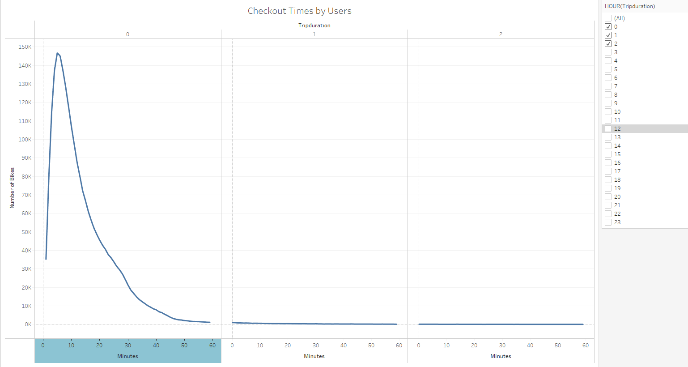
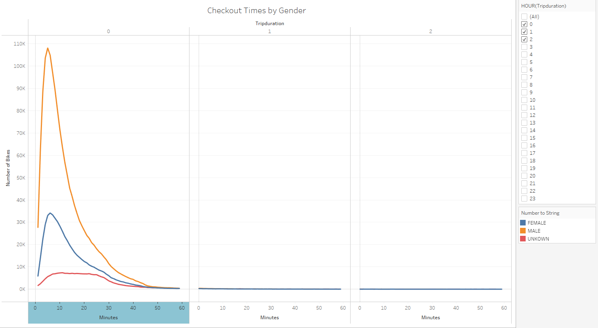
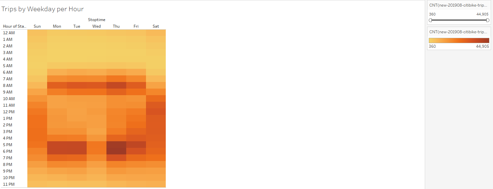
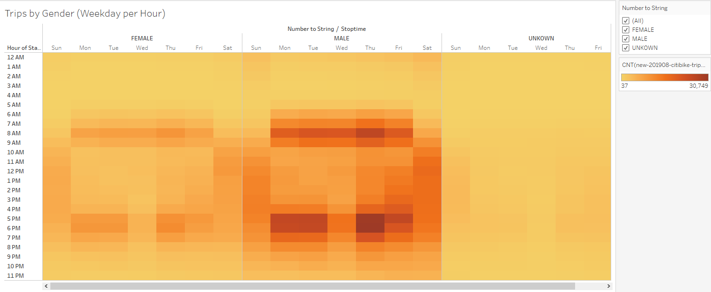
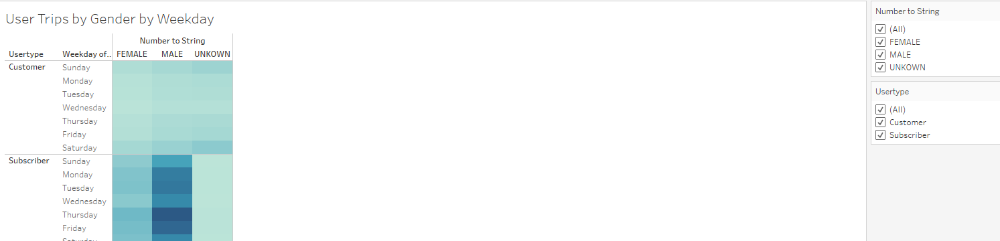
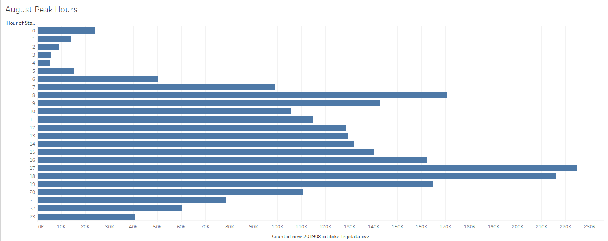
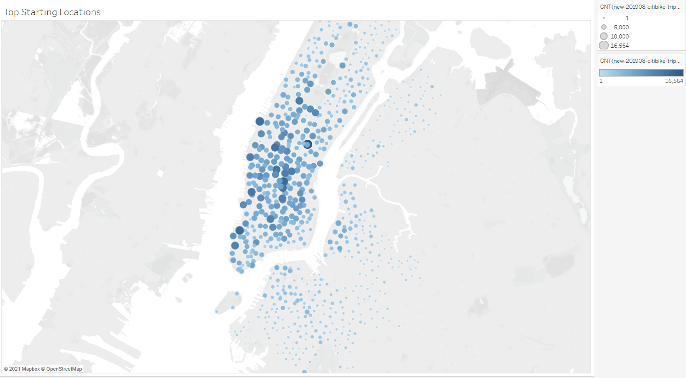

# Bikesharing
Module 14

## Overview of Analysis
To create a story to convince investors that a bike-sharing program in Des Moines, Iowa, is a solid business proposal.  We are using the NYC Citibike information from August 2019 to create the proposal.  This is an analysis to solidify the proposal for a key stakeholder. 

## Resources:

Software:  
Tableau Public, Jupyter Notebook, Anaconda 4.10.1, Python 3.7.6, Visual Studio Code 1.56.0
 
Code:  
[NYC_CitiBike_Challenge.ipynb](Challenge/NYC_CitiBike_Challenge.ipynb)

Images: 
[Images](Images/)  

Tableau Public: 
[NYC_Citibike](https://public.tableau.com/app/profile/franklin.t.brumwell/viz/NYC_Citibike_16266171124850/NYCCitibikeAnalysisforAugust2019?publish=yes)

## Results:

We have come up with 7 visuals to aide the proposal. 
 
 
As we can tell from this visual, the majority of users have the bike for less than 1 hour and peak of 10 minutes per use.   
 
 
When we look at the checkout times by gender (male, female, unknown) we see that the peaks and usage rates are fairly similar.  Males seem to prime users of the bike-share service more than females and unknown genders.
 
 
As we can see by this chart, Monday to Friday's use of the bike-share is from 6am to 9am and 4pm to 8pm.  This is an indicator that they are used to travel to and from work following a standard 8 hour workday of 9am to 5pm.  Saturday and Sunday prime usage is late morning to early evening, most likely recreational trips around the city.  We can tell that the service is used 7 days a week.   
 
 
Male and Female usage pattern seems to be the same.  As we know from earlier that people identifying as male use the service more often.   
 
 
This chart shows us again that males use the bike-share service more often and are a larger part of the subscriber base.
 
 
The 3 busiest hours of the bike-share service are:  
5pm (1700 hrs)  
6pm (1800 hrs)  
6am (0600 hrs)  
 
 
For a glimpse of the starting locations, the bike-share service has a higher user rate in the more urban and tourist area's of New York City.  The Des Moines, Iowa bike-share should concentrate on setting up locations with in the city limits and near any local parks and attractions.  

## Summary

We believe that the results of our analysis show that to open a bike-sharing service in Des Moines, Iowa needs to concentrate on finding the largest urban areas for living, working and recreation to place the bikes.  To start up the advertising dollars should be geared towards the largest user group, in this case males, to build the subscriber base.  Once the subscriber base is steady the advertising can be geared towards female users to encourage more use and gain a larger subscriber base. 

The next step in our analysis would be to check the data for every season (spring, summer, fall, winter) in 2019.  This would allow use to see how weather and temperatures affect the usage rates and to see if males are still the majority user and if urban areas and local attractions are the primary locations to set-up the bike-share.

After that we can sort the information by subscriber/gender and by customer/gender to get a better idea of where each type of bike-share user picks up and drops off the bike.  This can help us concentrate on the areas to expand the business.  